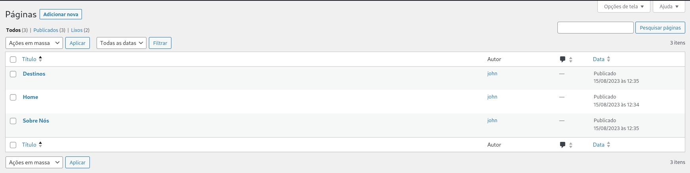

# alura_intercambios

# Índice
* [Abrir e rodar o projeto](#Abrir-e-rodar-o-projeto)

# Abrir e rodar o projeto

Após concluir a instalação do LAMP, siga estes passos:

1. Faça o download do WordPress a partir deste link: (https://br.wordpress.org/download/).
2. Instale e configure o WordPress conforme as instruções.
3. Vá até a pasta chamada "wp-content/themes".
4. Crie uma nova pasta dentro dela com o nome "alura_intercambios".
5. Coloque todos os arquivos que você baixou deste repositório dentro da pasta "alura_intercambios".
6. Agora, ative o tema que você acabou de adicionar.
7. Por fim, crie as páginas necessárias de acordo com as orientações.

| **TÍTULO**| **SLUG** |
| --------- | -------- |
| Home      | home     |
| Destinos  | destinos |
| Sobre Nós | sobre-nos|

